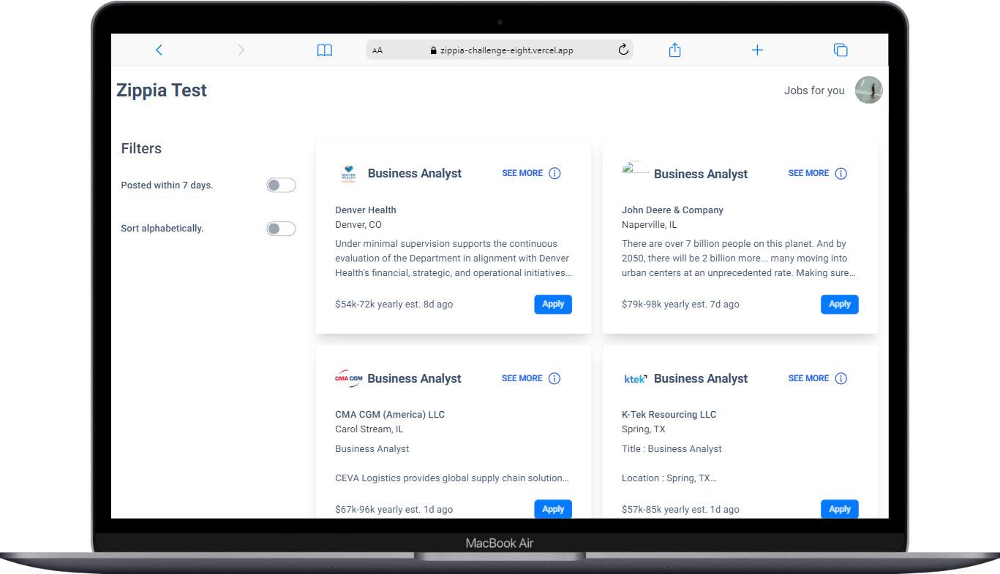
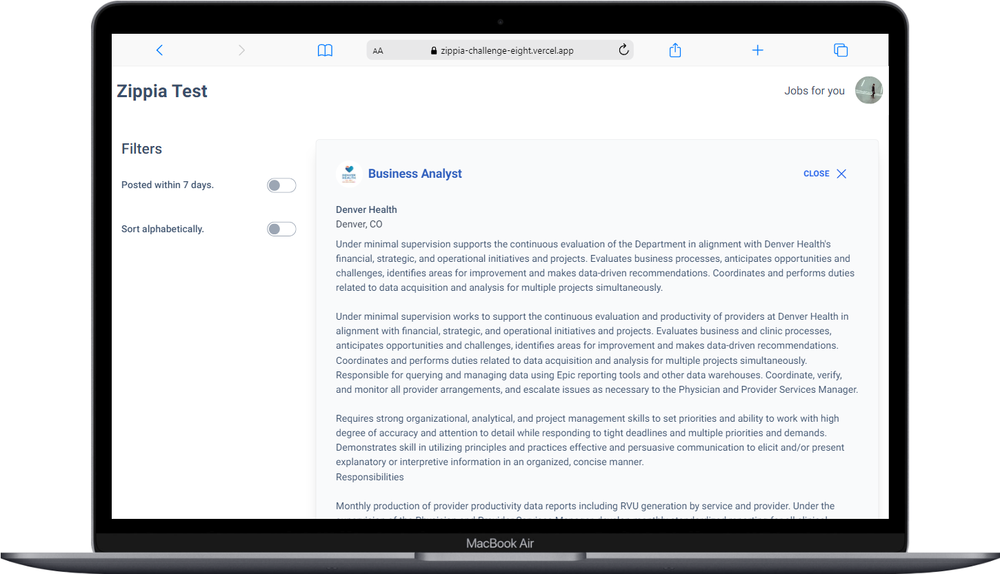
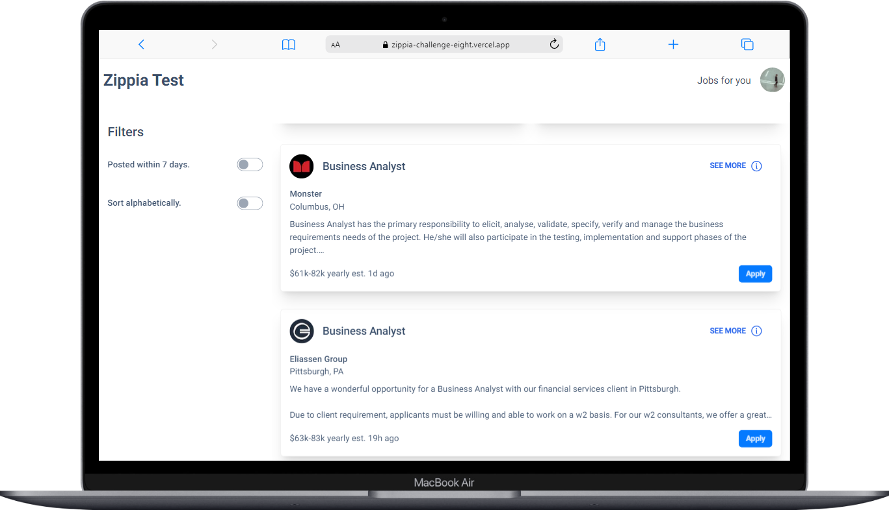
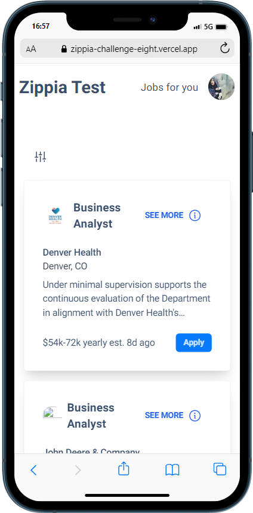
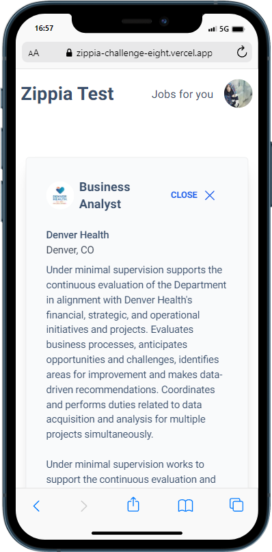
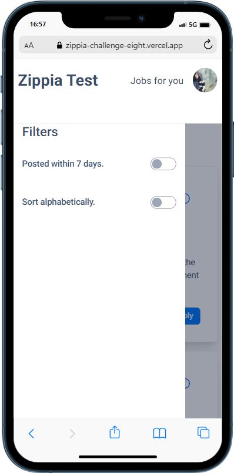

# Zippia Challenge

## 📚 Idea

This project was made for the web development job opportunity given by Zippia. The project is meant to be a page that renders job posts and render them.

There's not much functionality but I cared about styling it well and making it as responsive as it could.

## 💻 Technologies

- React.
- Typescript.

## 🔮 Libraries

- Axios
- TailwindCSS
- DaisyUI
- TRPC

## 🔆 Functionalities

- Back-end
  - Back-end was created using the Nextjs route api with TRPC, so there's no complete separate back-end. It works just like any other rest API but you can also search by specific items as you would using GraphQL
- Front-end
  - You can expand the job post
  - Click on the job to be redirected to the corresponding job page

## 📱 Preview

 - <a href="https://zippia-challenge-eight.vercel.app/test/jobs">Link do projeto</a> 

 
<h2 align="center"> Initial page </h2>

<h2 align="center"> Initial page but with job post open </h2>

<h2 align="center"> Initial page but on the list part </h2>

<h2 align="center"> Mobile </h2>

  

<h2 align="center"> Mobile Sidebar with job post open </h2>

  

<h2 align="center"> Mobile Sidebar </h2>

  

